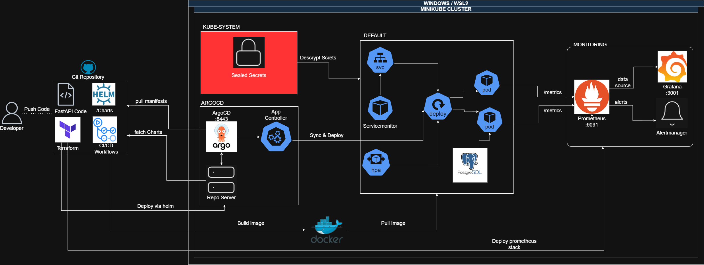

# DevOps Platform Demo 🌟

Plataforma **DevOps end-to-end** Laboratorio que demuestra habilidades profesionales en desarrollo, contenerización, orquestación, IaC, GitOps, monitoreo y seguridad.

**Problema que resuelve:**  
Despliegues automatizados y reproducibles,Infraestructura inmutable y versionada, Monitoreo en tiempo real con alertas, Rollback automático en caso de fallos, Escalado horizontal automático, GitOps para gestión declarativa y errores humanos frecuentes en entornos de producción.



---

## 🧰 Stack Tecnológico

| Área | Herramienta |
|------|-------------|
| Aplicación | Python / FastAPI |
| Contenedores | Docker |
| Orquestación | Kubernetes (Minikube) |
| IaC | Terraform |
| GitOps | ArgoCD |
| Paquetes K8s | Helm |
| Monitoreo | Prometheus + Grafana |
| Seguridad | Sealed Secrets + Trivy |
| CI/CD | GitHub Actions |
| Base de datos | PostgreSQL |

---

## 📁 Estructura del Proyecto

```text
devops-platform-demo/
├── .github/workflows/       # Pipeline CI/CD (GitHub Actions)
├── app/                     # Código fuente FastAPI
│   ├── test/                # Tests unitarios
│   ├── main.py
│   ├── config.py
│   ├── Dockerfile
│   └── requirements.txt
├── charts/devops-platform/  # Helm Chart
│   ├── templates/           # Manifests de Kubernetes
│   ├── Chart.yaml
│   └── values.yaml
├── img/                     # Imágenes de arquitectura
├── k8s/                     # Manifests raw para pruebas
├── scripts/
│   ├── deploy-tf.sh         # Despliegue con Terraform ⭐
│   ├── deploy.sh            # Despliegue con k8s/
│   ├── destroy-tf.sh        # Destruir infraestructura
│   └── stop-tunnels.sh      # Detener port-forwards
└── terraform/               # Infraestructura como código
    ├── main.tf
    ├── variables.tf
    └── outputs.tf
```

---

## 📦 Requisitos Previos

| Herramienta | Versión Mínima | Enlace |
|-------------|:--------------:|--------|
| Docker | 20.10+ | [Instalar](https://docs.docker.com/get-docker/) |
| Minikube | 1.30+ | [Instalar](https://minikube.sigs.k8s.io/docs/start/) |
| kubectl | 1.25+ | [Instalar](https://kubernetes.io/docs/tasks/tools/) |
| Terraform | 1.5+ | [Instalar](https://developer.hashicorp.com/terraform/install) |
| Helm | 3.10+ | [Instalar](https://helm.sh/docs/intro/install/) |
| Git | 2.30+ | [Instalar](https://git-scm.com/downloads) |
| Sealed Secrets (kubeseal) | 0.21.0+ | [Instalar](https://github.com/bitnami-labs/sealed-secrets/releases) |

> ⚠️ **Importante:** La versión de `kubeseal` instalada en la máquina local debe coincidir exactamente con la del controlador desplegado en el clúster de Minikube.

---

## 🚀 Instalación y Uso

### 1. Clonar el repositorio

```bash
git clone https://github.com/tu-usuario/devops-platform-demo.git
cd devops-platform-demo
```

### 2. Dar permisos de ejecución

```bash
chmod +x scripts/*.sh
```

### 3. Ejecutar el script de despliegue

```bash
./scripts/deploy-tf.sh
```

---

## 🤖 CI/CD — GitHub Actions

El pipeline se dispara automáticamente al hacer `push` en `main` con cambios dentro de `app/`.

**Flujo del pipeline:**

1. Instala dependencias y ejecuta lint con `flake8`
2. Corre tests unitarios con `pytest`
3. Construye la imagen Docker
4. Escanea vulnerabilidades con Trivy (`CRITICAL` y `HIGH`)
5. Publica la imagen en Docker Hub (solo si todo pasa)

> 🔑 Requiere los secrets `DOCKERHUB_USERNAME` y `DOCKERHUB_TOKEN` configurados en el repositorio.

### Actualizar versión

Cuando se suba una nueva versión, modificar los siguientes **3 archivos antes del `git push`** para que ArgoCD sincronice el despliegue correctamente:

**`app/config.py`**
```python
APP_NAME = os.getenv("APP_NAME", "DevOps Platform Demo V1.x")  # nueva versión
```

**`charts/devops-platform/Chart.yaml`**
```yaml
appVersion: "1.x.0"   # debe coincidir con la versión en config.py
```

**`charts/devops-platform/values.yaml`**
```yaml
config:
  appName: "DevOps Platform Demo V1.x"   # debe coincidir con config.py
```

> ♻️ Al hacer `git push` en `main`, el pipeline construye y publica la nueva imagen. ArgoCD detecta el cambio en el chart y sincroniza el despliegue automáticamente.

---

## ⚙️ ¿Qué hace `deploy-tf.sh`?

1. **Verifica Minikube** — Si no está corriendo, lo inicia con Docker y 4 GB de RAM.
2. **Instala Sealed Secrets** — Despliega el controlador en `kube-system` para cifrar secretos en Git.
3. **Ejecuta Terraform** — Formatea, inicializa, valida y aplica la infraestructura completa.
4. **Espera ArgoCD** — Aguarda a que `argocd-server` esté listo y obtiene la contraseña de admin.
5. **Espera pods de la app** — Verifica que los pods con label `app=devops-platform` estén en `Ready`.
6. **Espera Grafana y Prometheus** — Aguarda al deployment `monitoring-grafana` y obtiene su contraseña.
7. **Configura port-forwards** — Abre túneles en background para los 4 servicios:
   - App → `http://localhost:8080`
   - ArgoCD → `https://localhost:8443`
   - Grafana → `http://localhost:3001`
   - Prometheus → `http://localhost:9091`
8. **Abre la app en el navegador** — Usa `minikube service` si el servicio ya existe.
9. **Guarda los PIDs** — Escribe los PIDs en `/tmp/devops-platform-pids.txt` para limpiarlos fácilmente.

---

## 🌐 Servicios Disponibles

| Servicio | URL | Usuario |
|---------|-----|:-------:|
| App Principal | http://localhost:8080 | — |
| ArgoCD (GitOps) | https://localhost:8443 | `admin` |
| Grafana (Monitoreo) | http://localhost:3001 | `admin` |
| Prometheus (Métricas) | http://localhost:9091 | — |

> 🔑 Las contraseñas de ArgoCD y Grafana se imprimen en consola al finalizar el script.

---

## 🛑 Detener los servicios

```bash
# Detener todos los port-forwards
./scripts/stop-tunnels.sh

# Destruir la infraestructura completa
./scripts/destroy-tf.sh
```

---

## 👤 Autor

**Mateo Vega Castaño**

[](https://github.com/mvega09/devops-platform-demo)
[](https://www.linkedin.com/in/mateo-vega-casta%C3%B1o/)

---
